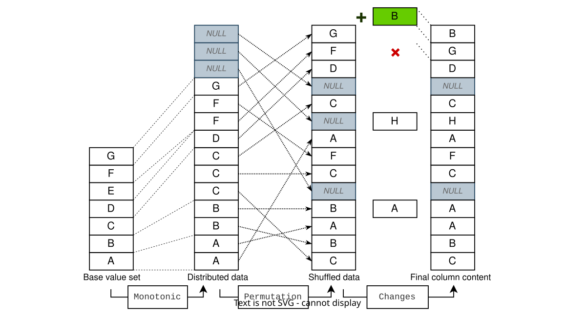

# HoloDB &ndash; the on-the-fly relational database

HoloDB is a relational database simulator that provides realistic mock data entirely on-the-fly, based on declarative configuration.
It behaves like a regular database but requires no real storage, making it ideal for demos, prototypes, testing, and education.


## :bulb: Why HoloDB?

> ***No data generation &ndash; no storage costs &ndash; no migrations.***
> 
> **Sketch up your schema and characteristics, and you're ready to start querying!**

HoloDB is for those moments when you need a database-shaped system without the hassle of managing real data.
Instead of setting up or importing datasets, you simply point it at a configuration (or ORM entities)
and instantly get a live, consistent, queryable database &ndash; ready for demos, prototypes, tests, or teaching.

What you get from it:

- **On-the-fly data engine** &rarr; generates consistent data dynamically, no pre-generation.
- **Declarative control** &rarr; lets you define schema and values via YAML/JSON config or JPA annotations.
- **Searchable and writable** &rarr; on-the-fly data you can still search and update like a real DB.
- **Versatile usage modes** &rarr; supports multiple ways to run (embedded, JPA-based, Docker etc.).
- **Integration options** &rarr; offers several ways to connect (JDBC, [MiniConnect](https://github.com/miniconnect/miniconnect), TCP) and upcoming integrations (Postgres, DBeaver).
- **Portable across environments** &rarr; runs seamlessly in Java or Docker, on any platform.
- **Open source and transparent** &rarr; freely available, inspectable, and adaptable to your needs.

Work with a database as if it were real, minus the cost of setup or maintenance.


## :rocket: Quick start

One easy way to try out HoloDB is to run it via [the official Docker image](https://hub.docker.com/r/miniconnect/holodb).
All you need is a YAML configuration file:

```yaml
seed: 98765
schemas:
  - name: my_schema
    tables:
      - name: my_table
        writeable: true
        size: 1500
        columns:
          - name: id
            mode: COUNTER
          - name: code
            valuesPattern: '[A-F]{3}[0-9]{2}'
          - name: year
            shuffleQuality: high
            valuesRange: [1950, 2000]
```

> [!TIP]
> [You can download a more complex sample configuration from here.](https://raw.githubusercontent.com/miniconnect/general-docs/refs/heads/main/examples/holodb-standalone/config.yaml).

Save this as `config.yaml`, and you are now ready to start the queryable database server:

```bash
docker run --rm -p 3430:3430 -v /tmp/config.yaml:/app/config.yaml miniconnect/holodb
```

You can now connect to the server on port 3430.
The simplest way to do this is to use the `micl` command line application, which is an SQL REPL.
You can get it from the [`miniconnect-client` project](https://github.com/miniconnect/miniconnect-client).
Start, select the schema, and run queries:

> `$` &nbsp; **`micl`**
>
>  > *Welcome in miniConnect SQL REPL! - localhost:3430*
>
> `SQL >` &nbsp; **`USE my_schema;`**
>
> > *Query was successfully executed!*
>
> `SQL >` &nbsp; **`SELECT * FROM my_table WHERE year = 1990 ORDER BY id LIMIT 5;`**
>
> > *Query was successfully executed!*
> >
> > ```
> >  ┌─────┬───────┬──────┐
> >  │ id  │ code  │ year │
> >  ├─────┼───────┼──────┤
> >  │ 125 │ ADB81 │ 1990 │
> >  │ 252 │ AEE24 │ 1990 │
> >  │ 280 │ BAC77 │ 1990 │
> >  │ 332 │ EFE77 │ 1990 │
> >  │ 371 │ BFF62 │ 1990 │
> >  └─────┴───────┴──────┘
> > ```

For other ways to use the server, such as connecting from your application, see later.


## :jigsaw: SQL features

Currently, a limited subset of the SQL features is supported by the default query engine.
It lacks some relatively basic features such as grouping and filtering by arbitrary expressions.
However it's powerful enough to serve queries of most ORM system.

Visit the [SQL guide](https://github.com/miniconnect/minibase/blob/master/SQL.md)
to learn more about the SQL features supported by the default query engine.
Alternatively, you can try the experimental integration with the
[Apache Calcite](https://github.com/miniconnect/calcite-integration) query planner.


## :pencil: Configuration reference

On the **top level** these keys are supported:

| Key | Type | Description |
| --- | ---- | ----------- |
| `seed` | `LargeInteger` | global random seed (global default: `0`) |
| `schemas` | `List` | list of schemas (see below) |

The `seed` option sets a random seed with which you can vary the content of the database.

For each **schema**, these subkeys are supported:

| Key | Type | Description |
| --- | ---- | ----------- |
| `name` | `String` | name of the database schema |
| `tables` | `List` | list of tables in this schema, see below (global default: none) |

For each **table**, these subkeys are supported:

| Key | Type | Description |
| --- | ---- | ----------- |
| `name` | `String` | name of the database table |
| `writeable` | `boolean` | writeable or not (global default: `false`) |
| `size` | `LargeInteger` | number of records in this table (global default: `50`) |
| `columns` | `List` | list of columns in this table, see below (global default: none) |

If `writeable` option is set to true, then an additional layer
will be added over the read-only table,
which accepts and stores insertions, updates, and deletions,
and it gives the effect that the table is writeable.

For each **column**, several subkeys are supported,
of which those related to the base value set and those related to additional settings can be distinguished
(some of the latter may also apply to the base value set).
At most one of the base value set keys should be used.
These keys all begin with the prefix `values`:

| Key | Type | Description |
| --- | ---- | ----------- |
| `values` | `Object[]` | explicit list of possible values |
| `valuesResource` | `String` | name of a java resource which contains the values line by line |
| `valuesBundle` | `String` | short name of a bundled value resource, otherwise similar to `valuesResource` (see below) |
| `valuesRange` | `LargeInteger[]` | start and end value of a numeric value range |
| `valuesPattern` | `String` | regex pattern for values (reverse indexed) |
| `valuesDynamicPattern` | `String` | regex pattern processed by [Generex](https://github.com/mifmif/Generex) (not reverse indexed) |
| `valuesTextKind` | `String` | text kind for dummy text: `phrase`, `title`, `sentence`, `paragraph`, `markdown`, or `html` |
| `valuesForeignColumn` | `String[]` | use value set of a foreign column (ideal for ID-based foreign keys) |

The `valuesTextKind` key can be used to generate dummy text in various forms.
These are based on randomly mixed words from the "lorem ipsum" text, supplemented with some English conjunctions.
The values will not be indexed
(for an indexed column containing single words, use the `valuesBundle` key with the value "lorem").
The available values are as follows:

| Text kind | Example | Description |
| --------- | ------- | ----------- |
| `phrase` | *eiusmod an aliqua ullamco* | a short phrase |
| `title` | *The Nulla Sit Tempor* | a title with capitalization |
| `sentence` | *Some exercitation an occaecat anim the duis.* | a sentence terminated with perid |
| `paragraph` |  | a paragraph of containing 3-6 sentences |
| `markdown` |  | MarkDown formatted text containing a few headers and paragraphs |
| `html` |  | HTML formatted text containing a few headers and paragraphs |

There are several possible values for `valuesBundle`:

| Bundle name | Description |
| ----------- | ----------- |
| `cities` | 100 major world cities |
| `colors` | 147 color names (from CSS3) |
| `countries` | 197 country names |
| `female-forenames` | 100 frequent English female forenames |
| `forenames` | 100 frequent English forenames (50 female, 50 male) |
| `fruits` | 26 of the best selling fruits |
| `log-levels` | 6 standard log levels (from log4j) |
| `lorem` | 49 lower-case words of the *Lorem ipsum* text |
| `male-forenames` | 100 frequent English male forenames |
| `months` | the 12 month names |
| `surnames` | 100 frequent English surnames |
| `weekdays` | the names of the 7 days of the week |

If used, the value of `valuesForeignColumn` must be an array of lengths 1, 2, or 3.
The one-element version contains a column name in the same table.
The two-element version contains a \[*\<table\>*, *\<column\>*\] pair in the same schema.
The three-element version contains the \[*\<schema\>*, *\<table\>*, *\<column\>*\] triplet.

The remaining column settings are as follows:

| Key | Type | Description |
| --- | ---- | ----------- |
| `name` | `String` | name of the table column |
| `type` | `String` (`Class<?>`) | java class name of column type |
| `mode` | `String` | filling mode: `default`, `counter`, `fixed`, or `enum` (global default: `default`) |
| `nullCount` | `LargeInteger` | count of null values (global default: `0`) |
| `distributionQuality` | `String` | distribution quality: `low`, `medium`, or `high` (global default: `medium`) |
| `shuffleQuality` | `String` | shuffle quality: `noop`, `very_low`, `low`, `medium`, `high`, or `very_high` (global default: `medium`) |
| `sourceFactory` | `String` | java class name of source factory (must implement `hu.webarticum.holodb.spi.config.SourceFactory`) |
| `sourceFactoryData` | *any* | data will be passed to the source factory |
| `defaultValue` | *any* | default insert value for the column |
| `seedKey` | `LargeInteger` | custom seed key |

In most cases, `type` can be omitted.
If the configuration loader cannot guess the type, the startup aborts with an error.
However, the type can always be overridden (e. g. numbers can be generated using a regular expression).

The meaning of `mode` values:

| Mode | Description |
| ---- | ----------- |
| `default` | randomly distributed, non-unique values, indexed (except in case of `valuesDynamicPattern` used) |
| `counter` | fill with increasing whole numbers starting from `1`, unique, indexed (good choice for ID columns) |
| `fixed` | values will not be shuffled, the count of values must be equal to the table size, non-indexed |
| `enum` | similar to `default`, but with different proper rules for equality check, sort order and insertion/update |

In the case of writable tables, if other than the `enum` mode is used,
users can also put values ​​different from the initial ones.

If `nullCount` is specified (even if `0`), then the column will be nullable.
Omit `nullCount` to make the column `NOT NULL`.
In case of custom `sourceFactory`, the column will be `NOT NULL` only iff
the source is an `IndexedSource` and has at least one null value.

Currently, for a `fixed` column, only `values` is supported.

In the case of `counter` mode, values will be ignored and should be omitted.
The type of a `counter` column is always `java.math.LargeInteger`.

If `seedKey` is specified, it will be explicitly used as a key for the sub-random-generator for the column.
Setting or changing this value alters the data distribution, shuffling, etc. for this column without affecting other columns.
If two columns share the same non-null `seedKey` while they have the same settings (except for `name`),
then they will provide the exact same values in the exact same order , effectively making them mirrors of each other.

You can set default configuration for schemas, tables, and columns at any higher level in the configuration tree.
Any value set at a lower lever will override any value set at a higher level (and, of course, the global default).

| Key | Available in |
| --- | ------------ |
| `schemaDefaults` | root |
| `tableDefaults` | root, `schemas.*` |
| `columnDefaults` | root, `schemas.*`, `schemas.*.tables.*` |

For example:

```yaml
tableDefaults:
  writeable: false
  size: 120
columnDefaults:
  shuffleQuality: noop
schemas:
  - name: schema_1
    tables:
      # ...
schemas:
  - name: schema_2
    tableDefaults:
      writeable: true
    tables:
      # ...
```

Using this config all table with no explicit `size` will have the size 120,
all table with no explicit `writeable` will read-only in `schema_1`, and writeable in `schema_2`.
Also, data shuffling is disabled by default.


## :arrow_down: Get the configuration JSON Schema

You can generate a JSON schema for this configuration data structure
by executing the `config:generateSchema` gradle task inside the holodb gradle project.
Then the generated schema file will be found here:

```
projects/config/build/schemas/holodb-config.schema.json
```


## :open_file_folder: Load values from resource

You can use custom predefined value sets too.
To do this, create a file with one value on each line.
Make this file available to the java classloader.
If you use docker, the easiest way to do this is to copy the file into the `/app/resources` directory:

```dockerfile
FROM miniconnect/holodb:latest

COPY config.yaml /app/config.yaml
COPY my-car-brands.txt /app/resources/my-car-brands.txt
```

You can use a predefined value set resource with the `valuesResource` key in `config.yaml`:

```yaml
          # ...
          - name: car_brand
            valuesResource: 'my-car-brands.txt'
```

If you don't already have a value list, you can retrieve existing data from several sources,
for example [WikiData](https://www.wikidata.org/),
[JSONPlaceholder](https://jsonplaceholder.typicode.com/)
or [Kaggle](https://www.kaggle.com/).

Here is an example, where we get data from WikiData, process it with `jq`, then save it to the docker image.
To safely achieve this, we use a builder image:

```dockerfile
FROM dwdraju/alpine-curl-jq:latest AS builder
RUN curl --get \
  --data-urlencode 'query=SELECT ?lemma WHERE \
    { ?lexemeId dct:language wd:Q1860; wikibase:lemma ?lemma. ?lexemeId wikibase:lexicalCategory wd:Q9788 } \
    ORDER BY ?lemma' \
  'https://query.wikidata.org/bigdata/namespace/wdq/sparql' \
  -H 'Accept: application/json' \
  | jq -r '.results.bindings[].lemma.value' \
  > en-letters.txt

FROM miniconnect/holodb:latest
COPY config.yaml /app/config.yaml
COPY --from=builder /en-letters.txt /app/resources/en-letters.txt
```


## :minidisc: Generate from an existing database

You can find an experimental python script in the `tools` directory
that creates a HoloDB configuration from an existing MySQL database.

Here is an example of how you can use it:

```bash
python3 mysql_scanner.py -u your_user -p your_password -d your_database -w
```

Use the `-h` or `--help` option for more details.


## :file_cabinet: Embedded mode via JDBC

You can use HoloDB as an embedded database.

To achieve this, first add the required dependency:

```gradle
implementation "hu.webarticum.holodb:embedded:${holodbVersion}"
```

Set the JDBC connection URL, specifying a resource:

```
jdbc:holodb:embedded:resource://config.yaml
```

Or any file on the file system:

```
jdbc:holodb:embedded:file:///path/to/config.yaml
```

Or with selecting a specific schema:

```
jdbc:holodb:embedded:resource://config.yaml?schema=university
```

(Note: Number of slashes does matter.)

Use the `hu.webarticum.holodb.embedded.HoloEmbeddedDriver` driver class if its explicit setting is mandatory.


## :arrows_counterclockwise: Client-server mode via JDBC

To achieve this, first add the required dependency:

```gradle
implementation "hu.webarticum.miniconnect:jdbc:${miniConnectVersion}"
```

Set the JDBC connection URL, specifying a resource:

```
jdbc:miniconnect://localhost:3430
```

Or with selecting a specific schema:

```
jdbc:miniconnect://localhost:3430/university
```

In this case, use the `hu.webarticum.miniconnect.jdbc.MiniJdbcDriver` driver class if necessary.


## :package: Mock JPA entities

To use the annotations below, set the `jpa-annotations` subproject as a dependency:

```gradle
implementation "hu.webarticum.holodb:jpa-annotations:${holodbVersion}"
```

If you want to use the service providers (e. g. `SourceFactory`), include the `spi` subproject too:

```gradle
implementation "hu.webarticum.holodb:spi:${holodbVersion}"
```

Actually running it requires the `jpa` subproject instead of the `jpa-annotations`:

```gradle
implementation "hu.webarticum.holodb:jpa:${holodbVersion}"
```

The `jpa` subproject has several dependencies (while `jpa-annotations` is near pure).
If you only use it for tests, define it as a test-only dependency.

Set this JDBC connection URL to use HoloDB as the database backend:

```
jdbc:holodb:jpa://
```

(Optionally, the schema can also be specified, e.g. `jdbc:holodb:jpa:///my_schema_name`.)

At the moment, schema construction is not fully automatic, it's necessary to explicitly pass the metamodel.
For example in Micronaut:

```java
@Singleton
public class HoloInit {
    
    private final EntityManager entityManager;
    
    public HoloInit(EntityManager entityManager) {
        this.entityManager = entityManager;
    }
    
    @EventListener
    @Transactional
    public void onStartup(StartupEvent startupEvent) {
        JpaMetamodelDriver.setMetamodel(entityManager.getMetamodel());
    }
    
}
```

The solution should be similarly simple for Spring or other frameworks.

Now, all of your entities will be backed by HoloDB tables with automatic configuration.
To fine-tune this configuration, you can use some annotation on the entity classes.
For example:

```java
@Entity
@Table(name = "companies")
@HoloTable(size = 25)
@HoloVirtualColumn(name = "extracol", type = Integer.class, valuesRange = {10, 20})
public class Company {
    
    @Id
    @GeneratedValue(strategy = GenerationType.IDENTITY)
    private Long id;
    
    @Column(name = "birth_country", nullable = false)
    @HoloColumn(valuesBundle = "countries")
    private String country;
    
    // ...
    
}
```


## :label: JPA annotations reference

These are the supported annotations:

| Annotation | Target | Description |
| ---------- | ------ | ----------- |
| `@HoloTable` | class | Overrides table parameters (schema, name, writeable, size) |
| `@HoloColumn` | field, method | Overrides column parameters |
| `@HoloIgnore` | class, field, method | Ignores an entity or attribute |
| `@HoloVirtualColumn` | class | Defines an additional column for the entity (multiple occurrences allowed) |

`@HoloColumn` and `@HoloVirtualColumn` accepts all the columns configurations
(for `@HoloVirtualColumn` `name` and `type` are mandatory).

Some numeric settings have two variants, one for usual and one for large values:

| Annotation | Usual field | Large field |
| ---------- | ----------- | ----------- |
| `@HoloTable` | `size` (`long`) | `largeSize` (`String`) |
| `@HoloColumn` | `nullCount` (`long`) | `largeNullCount` (`String`) |
| `@HoloColumn` | `valuesRange` (`long[]`) | `largeValuesRange` (`String[]`) |
| `@HoloVirtualColumn` | `nullCount` (`long`) | `largeNullCount` (`String`) |
| `@HoloVirtualColumn` | `valuesRange` (`long[]`) | `largeValuesRange` (`String[]`) |

Some settings accepts custom data:

| Annotation | Annotation field | Type | Config field |
| ---------- | ---------------- | ---- | ------------ |
| `@HoloColumn` | `sourceFactoryData` | `@HoloValue` | `sourceFactoryData` |
| `@HoloColumn` | `sourceFactoryDataMap` | `@HoloValue[]` | `sourceFactoryData` |
| `@HoloColumn` | `defaultValue` | `@HoloValue` | `defaultValue` |
| `@HoloVirtualColumn` | `sourceFactoryData` | `@HoloValue` | `sourceFactoryData` |
| `@HoloVirtualColumn` | `sourceFactoryDataMap` | `@HoloValue[]` | `sourceFactoryData` |
| `@HoloVirtualColumn` | `defaultValue` | `@HoloValue` | `defaultValue` |

Fields ending with the 'Map' suffix accepts an array of `@HoloValue`s,
you can use `@HoloValue.key` to set map entry key for each.


## :gear: How does HoloDB work?

HoloDB is a flexible virtual relational database engine written in Java.

Like other relational database engines,
HoloDB is a collection of tools built on top of a query engine
layered over a structured data access API.
The difference is that this API does not access a real pre-populated data storage,
but dynamically computes values from configuration.
Unlike simplistic SQL mocking techniques,
results remain realistic and mutually consistent across queries, computed dynamically yet reproducibly.

Column data is typically produced in layered steps:

1. **Base set**: an ordered, searchable, typically virtual collection of values
   (as simple as a numeric range or as complex as all strings matching a regex).  
2. **Distribution**: this base set is *stretched* over the required table size.
   The result is a monotonic, easily searchable list of values matching the configured characteristics.
3. **Shuffling**: the permutation layer makes the data look realistically random.
   This is always invertible, so search queries remain efficient and reproducible.



The base value set for a column is expected to be ordered and searchable.
Such a value set can be as simple as a numerical range
or as sophisticated as the huge space of strings matching to a complex regular expression.

The simplest but yet efficient distribution strategy is linear interpolation.
However a more fine-tuned distribution can be parameterized
with value frequency and some level of pseudo-randomness.
You can also explicitly configure the amount of null values mixed in.

The shuffling layer ensures realistic randomness through a pair of functions:
a permutation and its inverse.
High-quality implementations are typically based on Feistel cipher
and independently scalable hash functions.
However, simpler and more performant implementations such as linear congruential methods often suffice.
Exploring the trade-off between seemingly strong randomization and efficiency
is one of the project's intriguing areas.

Writable tables utilize a diff layer,
transparently tracking inserts, updates, and deletions separate from the immutable virtual baseline.
Concurrent modifications are managed by a lightweight transaction management layer,
ideal for short-lived writable datasets.

The on-the-fly computations rely heavily on arithmetic-centric operations
rather than data storage and retrieval.
For numeric efficiency, HoloDB introduces specialized types and algorithms,
most of which can be used standalone too.
For example, LargeInteger is an arbitrarily large numeric data type
somewhat inspired by similar double-nature implementations
such as SafeLong from the Spire library, BigInt from the Scala standard library, and others.
Compared to these, LargeInteger is more efficient in case of
frequent operations on smaller numbers.


## :notebook: Changelog

See [CHANGELOG.md](CHANGELOG.md).
